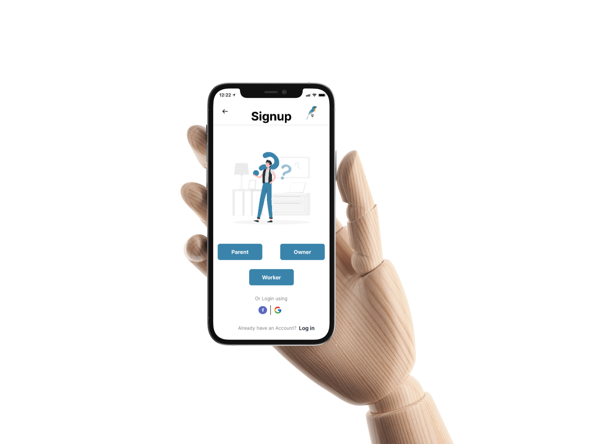
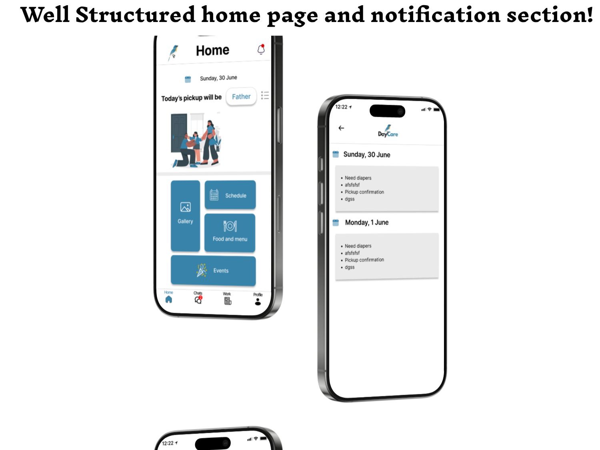
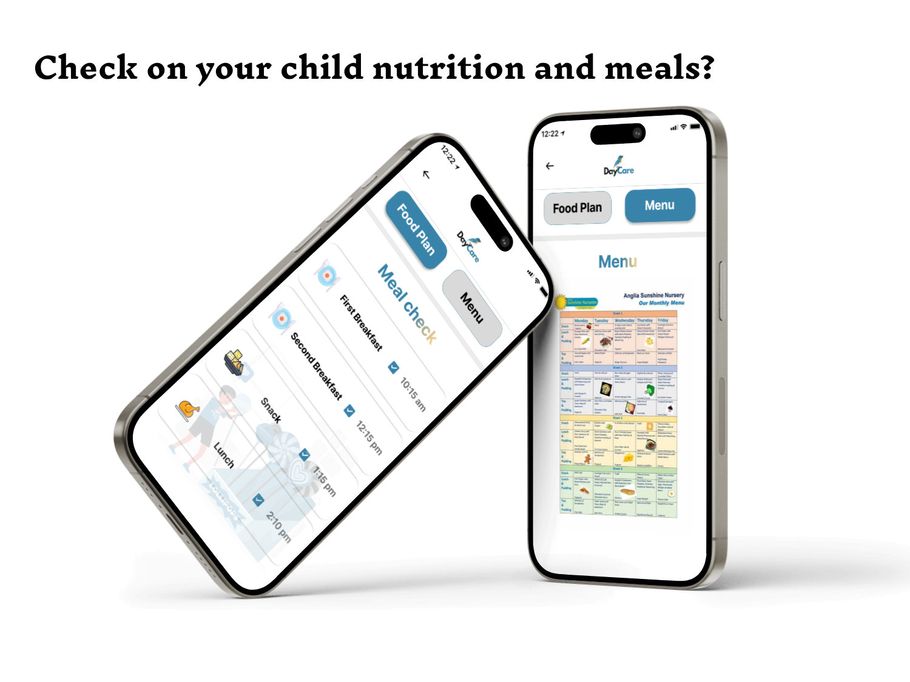
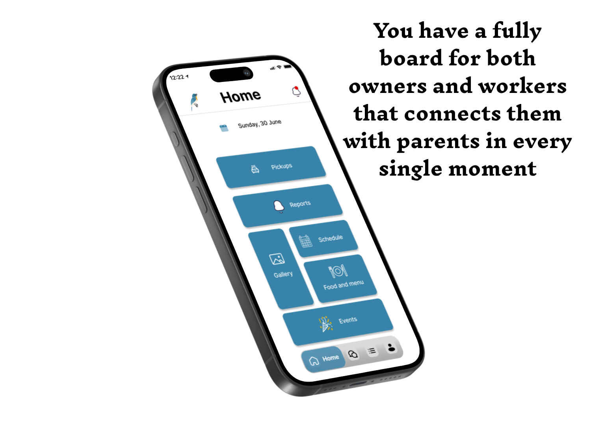
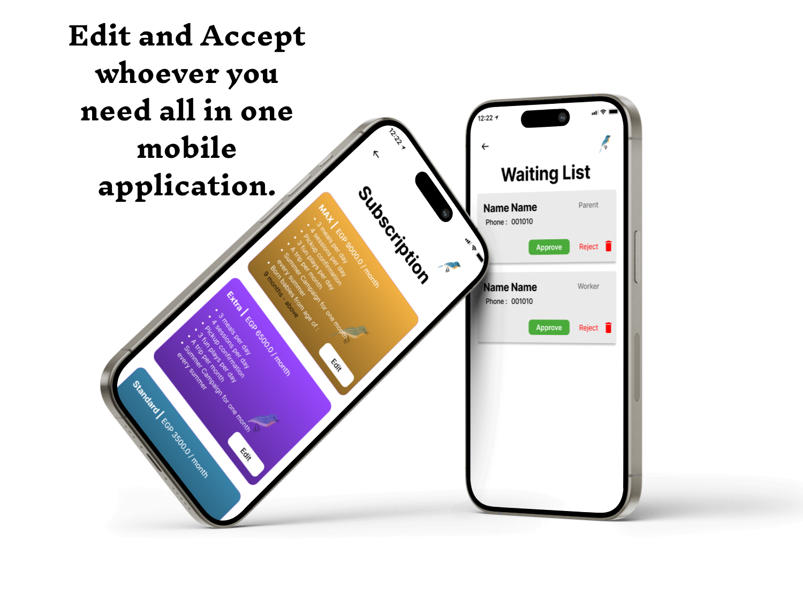

# DayCare

A comprehensive daycare management and booking platform built with Flutter, connecting parents, nursery owners, and caregivers through an intuitive end-to-end solution.

## 📱 Overview

Daycare revolutionizes childcare management by providing a seamless platform for discovering, booking, and managing daycare services. Built with modern Flutter architecture using BLoC pattern and dependency injection, the app offers real-time communication, interactive map-based discovery, and comprehensive management tools for all stakeholders.

## ✨ Key Features

### 🗺️ Map-Based Discovery
- **Interactive Google Maps Integration**: Search and discover daycares with visual map interface
- **Smart Filtering**: Filter by distance, ratings, availability, and custom preferences
- **AI-Driven Recommendations**: Intelligent suggestions based on user preferences and location

### 📅 Instant Booking & Management
- **Secure Spot Reservations**: Real-time booking with instant confirmation
- **Waitlist Management**: Automated waitlist handling and notifications
- **Payment Integration**: Secure payment processing for bookings
- **Capacity Analytics**: Real-time availability tracking and quota management

### 👨‍👩‍👧‍👦 Parent Dashboard
- **Live Activity Timeline**: Real-time updates on check-ins, meals, naps, and activities
- **Daily Summary Reports**: Comprehensive daily reports with photos and notes
- **In-App Chat**: Direct communication with caregivers and staff
- **Child Progress Tracking**: Monitor development milestones and activities

### 🏢 Owner & Staff Portal
- **Attendance Analytics**: Detailed insights into attendance patterns and trends
- **Reservation Management**: Approve/decline bookings and manage capacity
- **News & Events Publishing**: Share updates, announcements, and upcoming events
- **Health Checkup Workflows**: Track and manage child health records

### 💬 Real-time Communication
- **Instant Messaging**: Firebase Realtime Database powered chat system
- **Push Notifications**: Firebase Cloud Messaging for important alerts
- **Media Sharing**: Share photos, videos, and documents securely

## 🛠️ Tech Stack

### Frontend
- **Flutter** - Cross-platform mobile development framework
- **Dart** - Programming language
- **BLoC** - State management pattern for predictable state handling
- **GetIt** - Dependency injection for clean architecture

### Backend & Services
- **Firebase Authentication** - Secure user authentication and authorization
- **Cloud Firestore** - NoSQL database for scalable data storage
- **Firebase Realtime Database** - Real-time chat and live updates
- **Firebase Storage** - Media file storage and management
- **Firebase Cloud Functions** - Serverless backend logic
- **Firebase Cloud Messaging** - Push notifications

### Maps & Location
- **Google Maps Flutter SDK** - Interactive map integration
- **Location Services** - GPS and location-based features

## 🎨 Media & Design Assets

### 📱 App Design Showcase


#### Complete Design Flow (1-12)
The following SVG files showcase the complete user journey and app interface:

| Screen | Design Asset |
|--------|--------------|
| 1 |  | 
| 2 | |
| 3 | |
| 4 | | 
| 5 | | 
| 6 | | 
| 7 | | 
| 8 | | 
| 9 | | 
| 10 | | 
| 11 | | 
| 12 |  |
| 13 | | 


``` ```


## 🏗️ Architecture

The app follows clean architecture principles with:
- **BLoC Pattern** for state management
- **Repository Pattern** for data abstraction
- **Dependency Injection** using GetIt
- **Modular Structure** for scalability and maintainability


## 🚀 Getting Started

### 1. Clone the Repository
```bash
git clone https://github.com/yourusername/daycarefirst.git
cd daycarefirst
```

### 2. Install Dependencies
```bash
flutter pub get
```

### 3. Run the App
```bash
flutter run
```


## 📦 Build

### Android
```bash
flutter build apk --release
# or
flutter build appbundle --release
```

### iOS
```bash
flutter build ios --release
```


